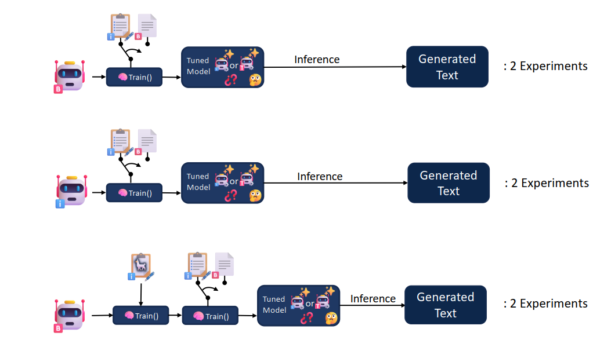
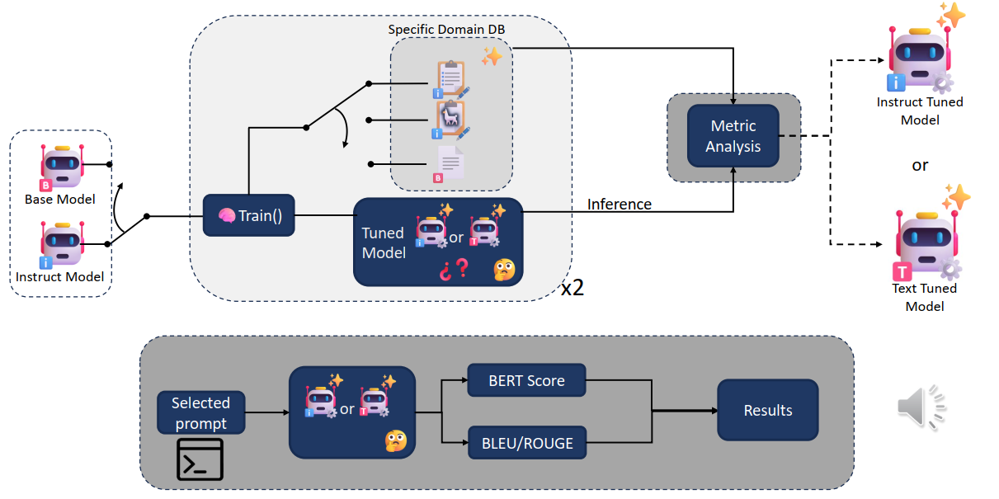
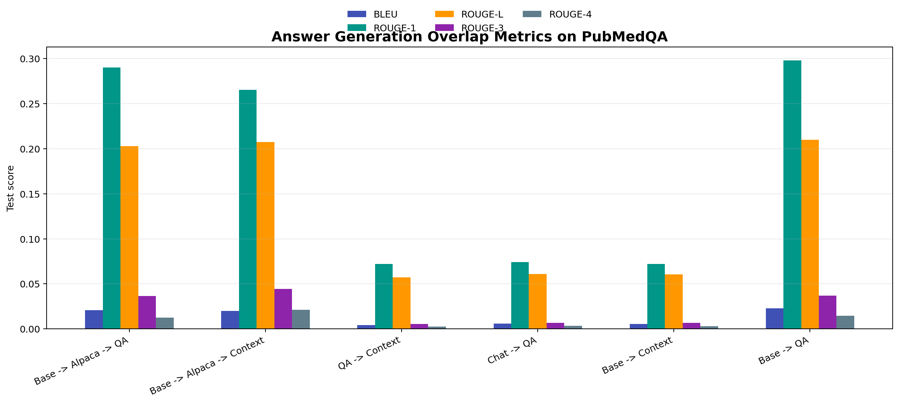
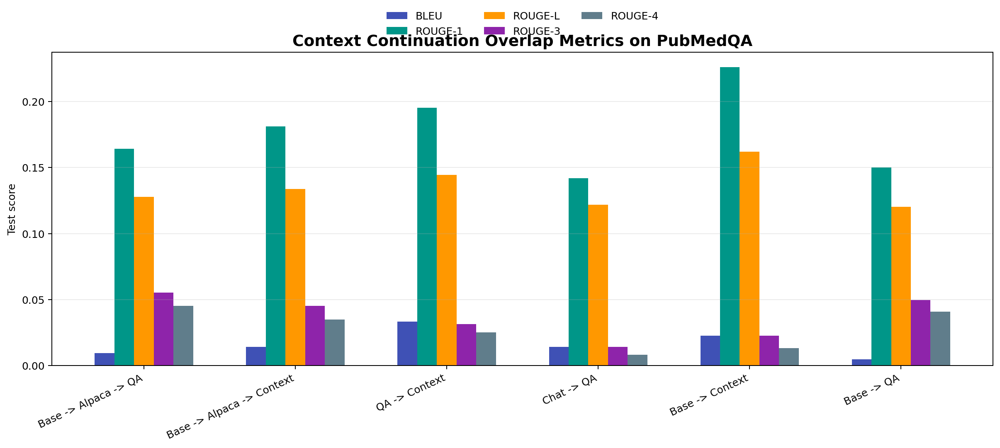
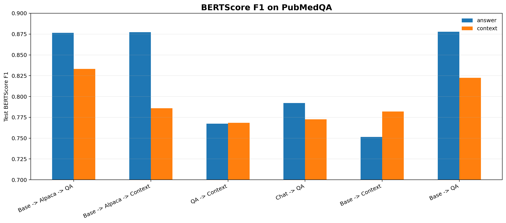

# Evaluating Fine-Tuning Strategies for Small LLMs

This repository benchmarks fine-tuning strategies for small language models in a biomedical QA setting. The project compares TinyLlama variants adapted with instruction tuning, PubMedQA question-answer tuning and PubMedQA context/text continuation objectives.

The original experiments were developed for a Natural Language Processing course and have been repackaged here as a compact benchmark with clean result tables, plotting scripts and reproducible evaluation utilities.

## Highlights

- Benchmarked six TinyLlama fine-tuning configurations on PubMedQA-style generation tasks.
- Compared answer generation and context continuation as separate evaluation modes.
- Used QLoRA/Axolotl for parameter-efficient fine-tuning.
- Evaluated outputs with BLEU, ROUGE and BERTScore.
- Found that `Base -> QA` was strongest for answer generation, while context continuation was more metric-dependent.

## Problem

Fine-tuning can change a language model in different ways depending on the starting checkpoint and the objective. A model tuned on domain text may become better at continuing biomedical context, while a model tuned on instruction-style question answering may produce better direct answers.

This project asks how combinations of base/chat TinyLlama checkpoints and text/instruction tuning objectives affect generation quality on PubMedQA-style prompts.

## Approach

The benchmark evaluates six model configurations:

| ID | Configuration | Starting Model | Training Path | Evaluation Focus |
|---|---|---|---|---|
| `model_0` | Base -> Alpaca -> QA | TinyLlama base | Alpaca instruction tuning followed by PubMedQA QA tuning | Answer |
| `model_1` | Base -> Alpaca -> Context | TinyLlama base | Alpaca instruction tuning followed by PubMedQA context tuning | Context |
| `model_2` | QA -> Context | TinyLlama adapter chain | PubMedQA QA tuning followed by PubMedQA context tuning | Mixed |
| `model_3` | Chat -> QA | TinyLlama Chat | PubMedQA QA instruction tuning | Answer |
| `model_4` | Base -> Context | TinyLlama base | PubMedQA context tuning | Context |
| `model_5` | Base -> QA | TinyLlama base | PubMedQA QA instruction tuning | Answer |



The project uses two evaluation modes:

1. **Answer generation:** generate an answer for a biomedical question.
2. **Context continuation:** continue PubMedQA biomedical context from an initial token prefix.

Training data was derived from PubMedQA:

| Dataset / Format | Source | Prompt Shape | Purpose |
|---|---|---|---|
| PubMedQA context text | Concatenated PubMedQA biomedical contexts | `<context prefix>` | Text-completion fine-tuning and context continuation evaluation |
| PubMedQA instruction QA | PubMedQA questions and long answers | `Question: <question>\nAnswer:` | Biomedical answer-generation fine-tuning and evaluation |
| Alpaca instruction data | General instruction-following examples | Instruction/input/output triplets | Intermediate instruction alignment before PubMedQA specialization |

The evaluation workflow compares each tuned model under both prompt styles, generates text, and computes BLEU, ROUGE and BERTScore against the corresponding PubMedQA references.



The training stack used TinyLlama, QLoRA adapters and Axolotl. Sanitized Axolotl configs are included in `configs/`; local checkpoint paths, Colab/Drive-specific paths and large adapter weights were intentionally not included.

## Results

The repository includes a tidy metrics table under `results/` and generated visualizations under `assets/`.

For answer generation, `Base -> QA` was the strongest configuration across most test metrics:

- Best BLEU: `Base -> QA` with `0.0229`.
- Best ROUGE-1: `Base -> QA` with `0.2980`.
- Best ROUGE-L: `Base -> QA` with `0.2100`.
- Best BERTScore F1: `Base -> QA` with `0.8778`.



For context continuation, the best configuration depended on the metric:

- Best BLEU: `QA -> Context` with `0.0333`.
- Best ROUGE-1 / ROUGE-L: `Base -> Context` with `0.2261` / `0.1619`.
- Best BERTScore F1: `Base -> Alpaca -> QA` with `0.8331`.



BERTScore is shown separately because it operates on a different scale from BLEU/ROUGE overlap metrics:



## Qualitative Examples

The original notebook also compared sample generations across prompt types. The table below keeps those observations searchable and easy to review:

| Prompt Type | Example Input | Representative Output Behavior |
|---|---|---|
| Answer generation | `Question: What is the role of mitochondria in cellular respiration? Answer:` | QA-tuned models produced direct biomedical-style answers, but some weaker configurations returned incomplete or blank generations. |
| Context continuation | `Assessment of visual acuity ...` | Context-tuned models were better at continuing biomedical prose, including study-style phrasing and clinical terminology. |
| Failure case | PubMedQA-style QA or continuation prompt | Some configurations generated degenerate repetition, citation fragments, or prompt-format artifacts, which is why qualitative inspection was paired with automatic metrics. |

## Repository Structure

```text
.
|-- assets/                         # README figures
|-- configs/                        # Sanitized Axolotl example configs
|-- results/                        # Model registry and tidy final metrics
|-- scripts/
|   `-- plot_results.py             # Rebuilds all README figures
|-- src/llm_ft_eval/
|   |-- data.py                     # PubMedQA JSONL builders
|   |-- evaluate.py                 # PEFT adapter evaluation CLI
|   `-- metrics.py                  # Lightweight overlap metrics
|-- tests/
|-- requirements.txt
|-- pyproject.toml
`-- README.md
```

## Installation

```bash
python -m venv .venv
source .venv/bin/activate
pip install -r requirements.txt
pip install -e .
```

On Windows PowerShell:

```powershell
python -m venv .venv
.\.venv\Scripts\Activate.ps1
pip install -r requirements.txt
pip install -e .
```

## Usage

Rebuild the figures from the final CSV results:

```bash
python scripts/plot_results.py
```

Build PubMedQA JSONL files for Axolotl:

```bash
python -m llm_ft_eval.data --output-dir data/processed
```

Evaluate a PEFT adapter on PubMedQA answer generation:

```bash
python -m llm_ft_eval.evaluate \
  --base-model-id TinyLlama/TinyLlama-1.1B-Chat-v0.1 \
  --adapter-id <your-hf-adapter-or-local-path> \
  --mode answer \
  --n-samples 15 \
  --max-new-tokens 128 \
  --output results/eval_outputs.csv
```

## Tech Stack

- Python
- PyTorch
- Hugging Face Transformers, Datasets and PEFT
- TinyLlama
- QLoRA
- Axolotl
- BLEU, ROUGE, BERTScore
- Pandas and Matplotlib

## Limitations

- Full training reproduction requires GPU access and may require adapting Axolotl versions to the local environment.
- Original training was run in Google Colab, so private Drive paths and large checkpoints/adapters were intentionally not included.
- The reported evaluation used small PubMedQA samples, so metrics should be interpreted as a benchmark snapshot rather than a definitive biomedical QA leaderboard.
- BLEU and ROUGE measure lexical overlap and can miss clinically relevant semantic differences.
- BERTScore is more semantic but still not a substitute for expert biomedical evaluation.

## Future Work

- Re-run all configurations with a larger and fixed PubMedQA evaluation split.
- Add exact Axolotl configs for every model variant once checkpoint lineage is fully standardized.
- Add a larger curated qualitative comparison across all model configurations.
- Evaluate factuality and medical correctness beyond lexical/embedding similarity metrics.
- Compare TinyLlama against stronger small models and more recent instruction-tuned checkpoints.
